# *** Authentication Flow with Role Based Access ***


## Project Description :
This project is a full-stack application that implements user authentication and role-based access control (RBAC). It consists of:

A Flask (Python) backend providing APIs for authentication, authorization, and user management.
A Next.js frontend that consumes the backend APIs and provides a user-friendly interface.
Database (SQlite)

## Features

- **User Authentication:**
  - Registration with optional profile picture, first name, last name, email, password, and mobile number, requiring OTP email verification.
  - Login using email and password with JWT token issuance.
  - OTP verification via email to complete registration.
- **Token Management:**
  - Implementation of JWT Access and Refresh tokens for secure authentication.
  - Automatic token refresh handled by Axios interceptors on the frontend.
- **Role-Based Access Control (RBAC):**
  - Predefined Super Admin credentials for administrative access.
  - Super Admin capability to create, view, edit, and delete user accounts.
  - Regular users can log in but are restricted from admin functionalities.
- **Admin Dashboard:**
  - A web-based dashboard for Super Admins to manage all users (CRUD operations).
  - Role-based redirection ensures only authorized access.

## Setup Instructions: 

This repository contains two main directories: `frontend` and `backend`. Follow the steps below to set up and run the application.

### Backend Setup

1. **Navigate to the Backend Directory:**
   ```bash
   cd backend

2. **Create and activate a virtual environment:**
   ```bash
   python -m venv venv 
   .\venv\Scripts\activate  # Windows

3. **Install dependencies:**
   ```bash
   pip install -r requirements.txt

4. **Create a .env file in backend:**
Create a .env file in the backend directory with the following

- SECRET_KEY=your_secret_key
- DATABASE_URI=sqlite:///site.db
- JWT_SECRET_KEY=your_jwt_secret_key
- MAIL_SERVER=smtp.gmail.com
- MAIL_PORT=587
- MAIL_USE_TLS=True
- MAIL_USERNAME=your_email@gmail.com
- MAIL_PASSWORD=your_gmail_app_password

**Notes:**
- Generate SECRET_KEY and JWT_SECRET_KEY using a secure random string generator (e.g., openssl rand -hex 32).
- Use a Gmail App Password for MAIL_PASSWORD (generate at https://myaccount.google.com/security).
- Ensure email settings are valid for OTP delivery.


5. **Run the backend:**
   ```bash
   python main.py

The API will be available at http://localhost:5000.


## Frontend Setup

1. **Navigate to frontend directory:**
   ```bash
   cd frontend

2. **Install dependencies:**
    ```bash
    npm install

Next.js, React, react-hook-form, yup, axios

3. **Configure Environment Variables:**
Create a .env.local file in the frontend directory:

 - NEXT_PUBLIC_API_URL=http://localhost:5000

Ensure the API URL matches your backend server address.

4. **Run the frontend:**
   ```bash
   npm run dev

The app will be available at http://localhost:3000.

## How to Clone this repo and Run

1. **Clone the repository:**
    ```bash
    git clone https://github.com/yourusername/auth-flow-rbac.git
    cd auth-flow-rbac

2. **Follow the setup instructions above for backend and frontend**
 
 Complete the backend and frontend setup steps outlined above.

3. **Default Super Admin credentials:**
  **SuperAdmin**
Email: admin@example.com
Password: adminpass

4. **Dependencies**
**Backend:**

- Flask
- Flask-RESTX
- Flask-SQLAlchemy
- Flask-JWT-Extended
- Flask-Mail
- itsdangerous
- python-dotenv
- flask-cors

**Frontend:**

- Next.js
- Axios
- React-Hook-Form
- Yup
- Tailwind CSS
- jwt-decode


# How to use 


- Register:
Visit /register, fill in the required fields, upload an optional profile picture, and submit.
Check your email for an OTP, enter it on the verification page, and complete registration.

- Login:

Navigate to /login, enter your email and password, and submit to receive JWT tokens.

- Admin Dashboard:

Log in as the Super Admin to access /dashboard and manage users (create, view, edit, delete).

- RBAC:

Only Super Admins can access the dashboard; regular users are redirected to the welcome page.


## Screenshots

Below are the detailed screenshots of the application in action: 

### Registeration Page

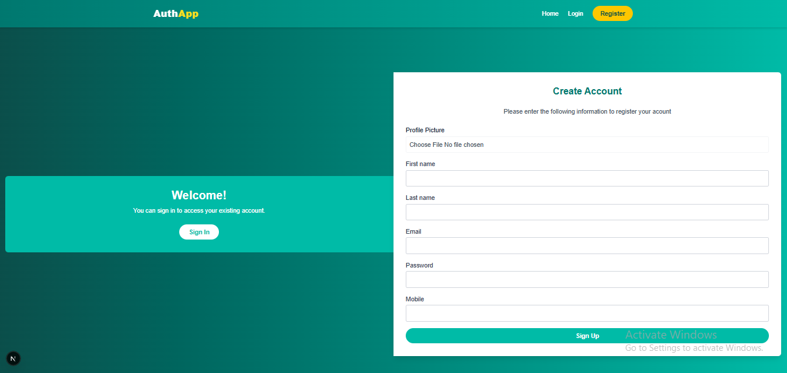

### Login page 

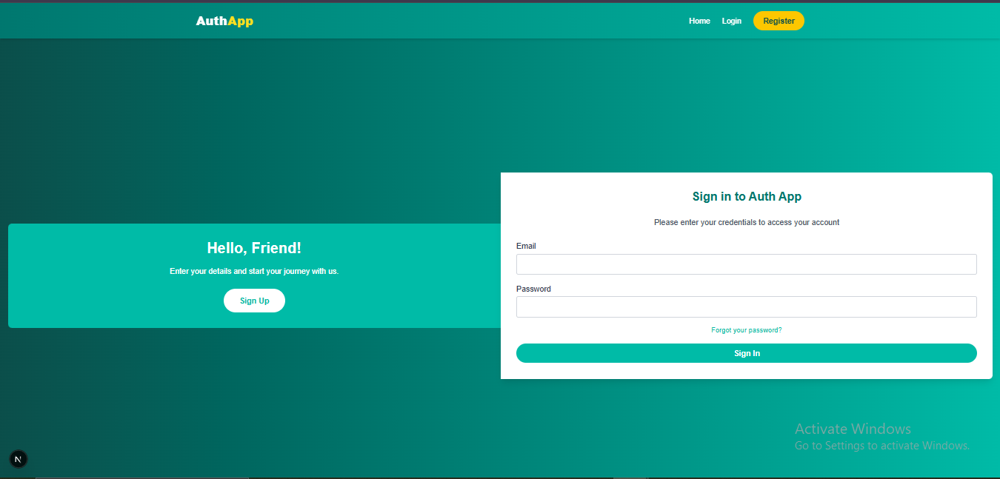


### This is Admin logging in  

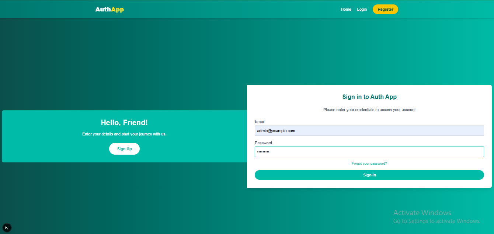

### This is Admin Dashboard  

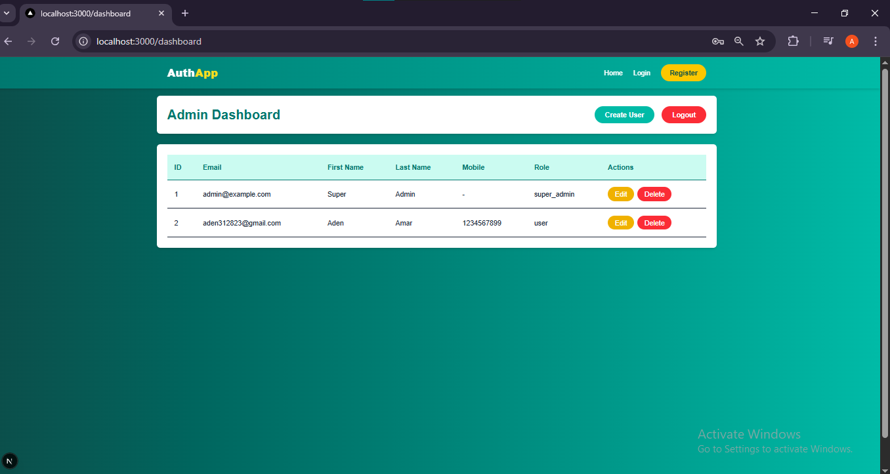

### This is Admin creating a new user

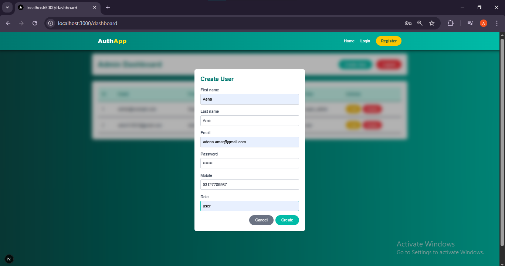

### New user successfully created in admin dashboard  

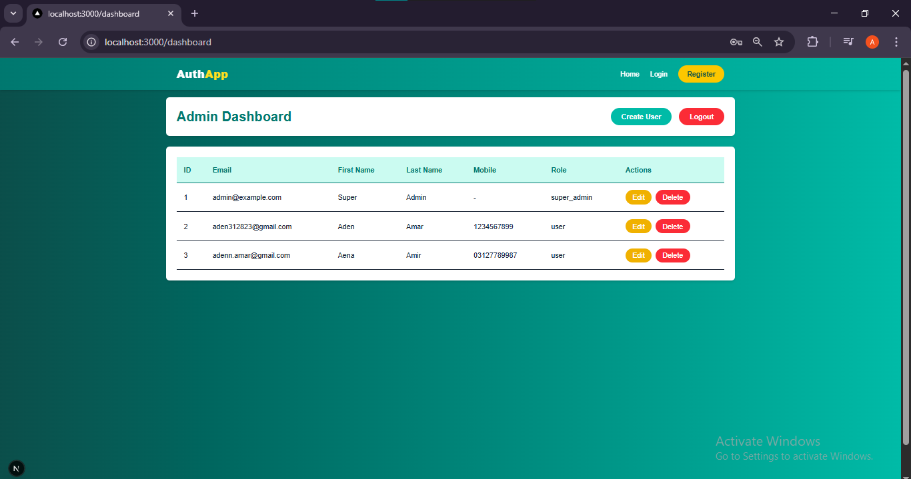

### Admin editing a user

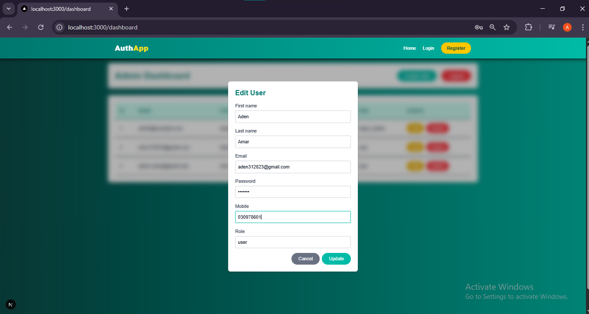

### User2 phone num Edited successfully by Admin 

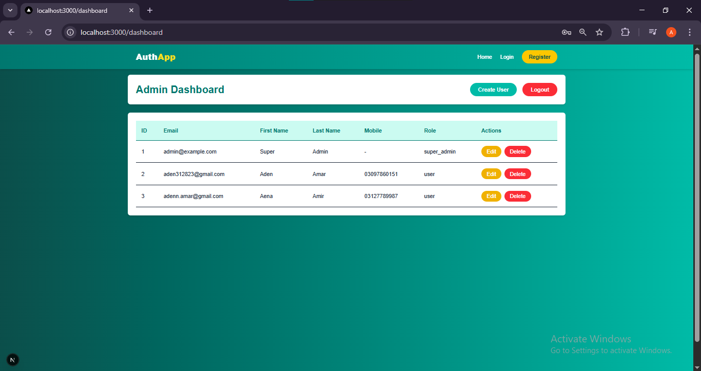

### Admin deleting a user

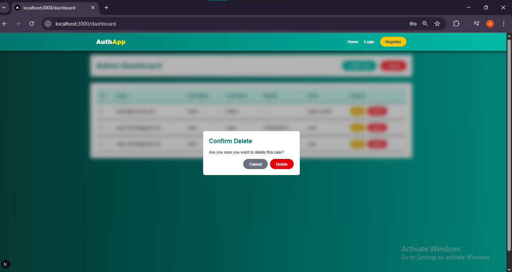

### User deleted successfully

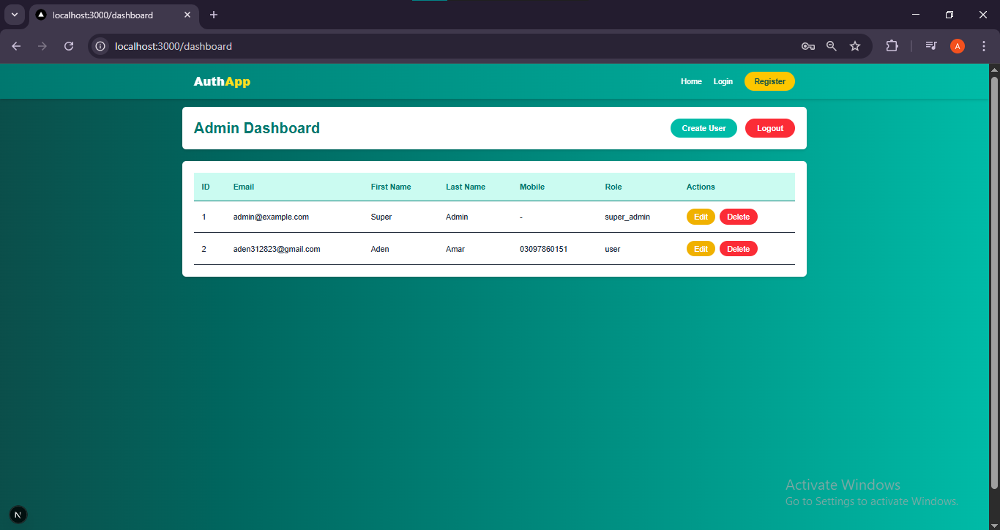

### Registeration by a new user

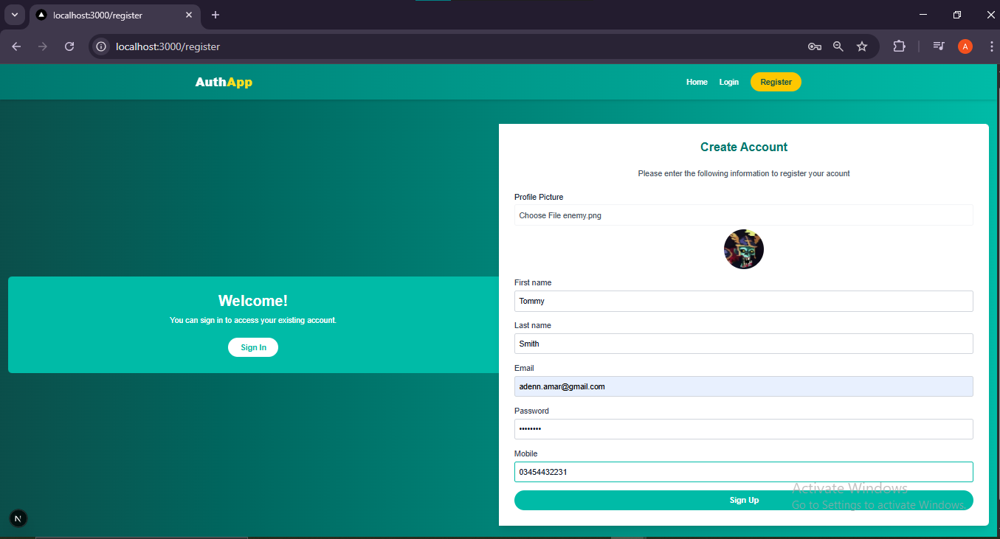

### Error if fields missing

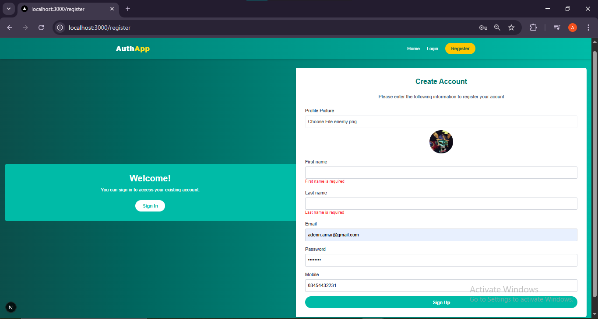

### Successfully received OTP

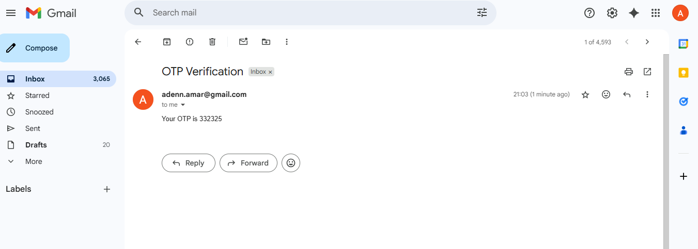

### Verifying OTP

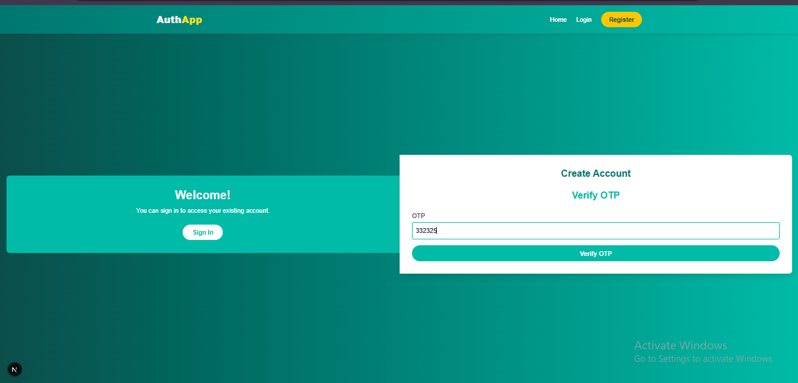

### Log in user account after registeration

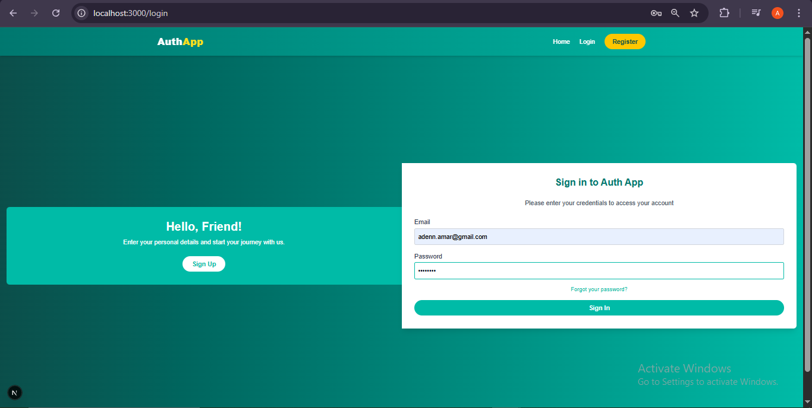

### After log in user is directed to Welcome page not Admin Dashoard

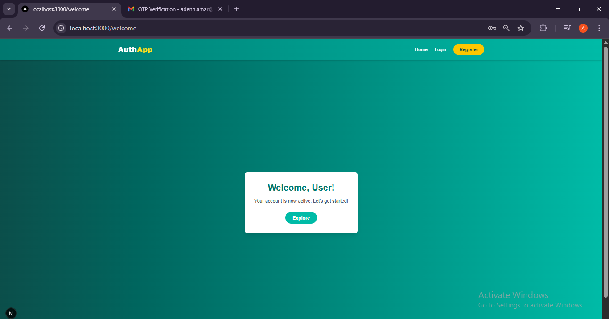

### New user displayed in Admin Dashboard

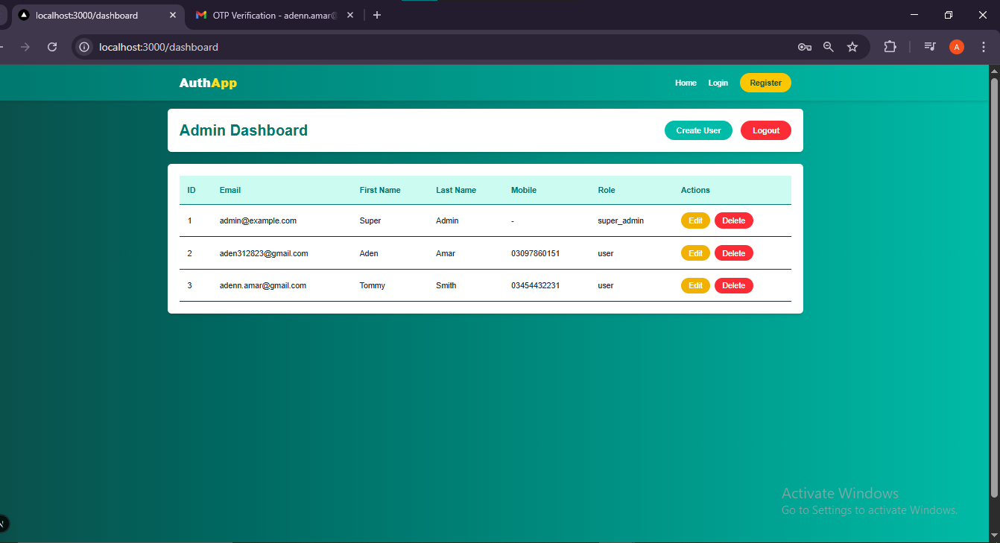


# Notes
- Email Configuration: Verify MAIL_USERNAME and MAIL_PASSWORD in the .env file for OTP delivery to work.
- For production, use httpOnly cookies instead of localStorage for JWT tokens to enhance security.
- The utils/axiosinstance.js handles automatic token refresh for expired access tokens.